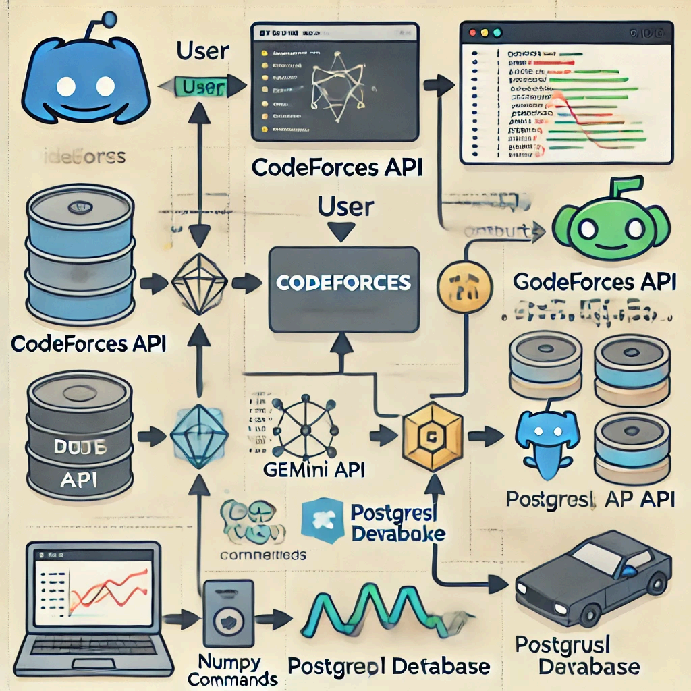

# Codeforces Discord Bot Project Report

**GitHub Repo Link** : https://github.com/ShaunAlanJoseph/Python-Project

**Link to Presentation** :

## Overview
### Team Introduction
The Codeforces Discord Bot project was developed by the following team members:
- Nooh-2023BCD0003
- Shaun-2023BCD0006
- Sachin Giri-2023BCD009
- Aryan P-2023BCD0012
- Akshay-2023BCD0015
- Akhil K-2023BCD0018
- 
### Project Description
The Codeforces Discord Bot is a tool designed to enhance the experience of competitive programmers on Discord. 
It provides real-time insights, analysis, and suggestions based on users' Codeforces activity. This bot offers a range of functionalities, 
such as problem analysis, personalized recommendations, and a community leaderboard, to encourage skill development and engagement.

### Technologies Used
- **Discord.py**: To manage bot functionalities and interact with Discord.
- **Codeforces Web Scraping API**: For fetching user data, problem sets, and contest details.
- **google-generativeai**: For integrating Google's Gemini AI model through API authentication and communication.
- **PostgreSQL**: Used as the database to store user data, statistics, and problem-solving history.
- **NumPy**: For numerical computations and analyzing user performance data.
- **Matplotlib**: For data visualization, generating graphs for user analysis.
- **Requests Module**: For handling HTTP requests to interact with external APIs, such as the Gemini and Codeforces APIs.

### Bot Features
1. **Problem Analysis and Rating Growth**
   - **Description**: Analyzes solved problems and tracks users’ rating changes.
   - **Graphical Representation**: Displays dynamic graphs of rating growth and problem-solving trends.

2. **Problem Suggestions**
   - **Description**: Provides tailored problem recommendations based on user ratings and recent activity.
   - **Functionality**: Continuously challenges users at their skill level, aiding in skill improvement.

3. **Account Comparison**
   - **Description**: Allows users to compare their Codeforces account metrics with others.
   - **Graphical Analysis**: Generates visual comparisons showing problem-solving and rating metrics differences.

4. **Integrated Gemini API**
   - **Description**: Gemini API integration for:
     - Answering programming-related questions.
     - Providing guidance on using the bot effectively.
     - Offering improvement tips for specific programming areas.

5. **Leaderboard System**
   - **Description**: A leaderboard ranked by ratings and solved problems to foster community engagement.
   - **Community Engagement**: Motivates users to improve and engage through friendly competition.

---

## 1. Project Planning

### Project Title:
Codeforces Discord Bot

### Define Objectives:
The Codeforces Discord Bot is designed to support competitive programmers on Discord. It enables users to track their Codeforces activity, analyze performance trends, receive problem recommendations, and engage with a leaderboard. The bot also provides real-time responses to programming-related questions via Gemini API.

---

## 2. Requirement Analysis

### System Specification:
- **Functional Requirements**:
  - Ability to register users with their Codeforces handle.
  - Generate rating graphs and comparison graphs.
  - Display leaderboards based on Codeforces rankings and solved problem counts.
  - Integration with Gemini API to answer user queries.
  - Personalized problem recommendations.

- **Non-Functional Requirements**:
  - **Performance**: Must efficiently handle multiple users querying at once.
  - **Security**: Secure storage and access of user details and interactions.

### Data Requirements:
- **Types of Data**:
  - User data (user_id, Codeforces handle, registration date)
  - Problem data (problem_id, rating, tags, status)
  - Ratings (user_id, date, rating)
  - Leaderboards (user_id, max_rating, problems_solved_count)

- **Relationships**:
  - Users are associated with multiple ratings and problems solved.
  - Problems are associated with multiple users through leaderboards.

---

## 3. Workflow Design

### Conceptual Workflow Design:
The bot’s workflow is illustrated in the following image, demonstrating data flow and integration between user input, Discord API, Codeforces API, Gemini API, PostgreSQL database, and data processing libraries (NumPy, Matplotlib).

**Workflow Diagram**:


**Overview**:
- **User Interaction via Discord**: Users input commands through Discord.
- **Discord API**: Manages communication and command handling.
- **PostgreSQL Database**: Stores data on users, performance stats, and histories.
- **Codeforces API**: Fetches real-time data on users’ performance and contest data.
- **Gemini API**: Handles general programming-related questions.
- **Data Analysis with NumPy and Matplotlib**: Processes data for graphs like rating comparisons and leaderboards.

### Workflow Steps:

1. **Command Input**: Users input commands through Discord.
2. **Command Parsing**: The Discord API forwards commands to the bot.
3. **API Calls and Database Access**:
   - Commands use the PostgreSQL database for saved data.
   - Codeforces API provides data related to user performance and problems.
   - Gemini API handles user questions if a query command is detected.
4. **Data Processing**:
   - NumPy processes performance data.
   - Matplotlib generates visualizations for ratings and leaderboards.
5. **Response Display**: Processed data and graphs are returned to Discord.

---

## 4. Implementation

### Core Python Functions

Below are Python functions used for command handling, data processing, and API integration.

#### Functions

- **Fetch User Ratings**:
  ```python
  def fetch_user_ratings(handle):
      response = requests.get(f"https://codeforces.com/api/user.rating?handle={handle}")
      if response.status_code == 200:
          return response.json()['result']
      else:
          return None
  ```

- **Generate Rating Graph**:
  ```python
  import matplotlib.pyplot as plt

  def generate_rating_graph(user_data):
      dates = [entry['ratingUpdateTimeSeconds'] for entry in user_data]
      ratings = [entry['newRating'] for entry in user_data]
      plt.plot(dates, ratings, label='Rating Over Time')
      plt.xlabel('Date')
      plt.ylabel('Rating')
      plt.title('User Rating Growth')
      plt.legend()
      plt.savefig('rating_graph.png')
  ```

- **Problem Recommendation**:
  ```python
  def recommend_problem(user_id, db_connection):
      rating = get_user_rating(user_id, db_connection)
      query = "SELECT * FROM problems WHERE rating <= %s ORDER BY RANDOM() LIMIT 1"
      cursor = db_connection.cursor()
      cursor.execute(query, (rating,))
      result = cursor.fetchone()
      return result
  ```

- **Leaderboard Display**:
  ```python
  def display_leaderboard(db_connection):
      query = "SELECT handle, max_rating FROM users ORDER BY max_rating DESC LIMIT 10"
      cursor = db_connection.cursor()
      cursor.execute(query)
      leaderboard = cursor.fetchall()
      return leaderboard
  ```

### Gemini AI Integration

The Discord bot integrates Google's Gemini AI model to provide intelligent responses and assistance. The integration is implemented in the `GeminiAgent` cog with several key features:

#### Core Functionality
- **Command-based Queries**: Users can directly query Gemini using the `$query` command
- **Help Context**: The bot maintains a comprehensive help context that Gemini uses to answer command-related questions
- **Direct Messaging**: Supports private conversations with users through [Discord](https://discord.com/)'s DM system
- **Toggle-able Response Mode**: Can be enabled/disabled for responding to general channel messages

#### Key Components

1. **Initialization**:
```python
def __init__(self, bot):
    self.bot = bot
    self.model = genai.GenerativeModel('gemini-pro')
```

2. **Message Handler**:
- Processes different types of messages (help queries, direct messages, general chat)
- Includes context-aware responses for help commands by combining user questions with predefined help documentation
- Handles message length limitations by chunking responses

3. **Control Commands**:
```python
@gemini.command()
async def enable(self, ctx):
    global Gemini, first_time
    Gemini = True
    await ctx.send('Gemini Agent is enabled..')

@gemini.command()
async def disable(self, ctx):
    global Gemini, first_time
    Gemini = False
    first_time = True
    await ctx.send('Gemini Agent is disabled..')
```

4. **Passing help context to the bot**:
- Maintains a global `helpContext` variable containing comprehensive documentation of all available commands
- When users make help queries with `!help`, the bot combines the user's question with the `helpContext`
- Implementation in the message listener:
  ```python
  elif msg.content[:5] == "!help":
      prompt = msg.content[5:]
      response = self.gemini_generate_content(helpContext + prompt)
      await self.send_message_in_chunks(msg.channel, response)
    ```

6. **Error Handling**:
- Implements retry mechanism for API calls with configurable attempts and delays
- Graceful error messaging for failed requests
- Message chunking to handle [Discord](https://discord.com/)'s message length limitations

#### Usage Examples
- General queries: `$query How do I use the rating graph command?`
- Help system: `!help What are the available commands?`
- Direct messaging: Use `$pm` to start a private conversation with the bot
- Toggle Gemini: `$gemini enable` or `$gemini disable`

The integration ensures that Gemini has access to bot-specific context while maintaining the flexibility to handle general queries and conversations.


This section provides a comprehensive overview of how Gemini AI is integrated into the Discord bot, highlighting the key features and implementation details while maintaining consistency with the existing codebase.

### User Interface (UI) Design:
  For this project, the UI is implemented as a Discord bot using the `discord.py` python library.

---

## 5. Testing and Validation

### Test Cases:

- **User Registration**:
  - Register a new user and verify if data is stored in the database.
  - Retrieve user details to confirm successful registration.

- **Graph Generation**:
  - Generate a user’s rating graph and validate data accuracy.
  - Compare rating graphs of two users to test comparison functionality.

- **Problem Recommendation**:
  - Recommend a problem based on user rating and confirm within specified range.

- **Leaderboard**:
  - Retrieve leaderboard and verify correct sorting by rating or problems solved.

### Validation:

- **Functional Validation**: All command responses function as intended.
- **Performance Validation**: Bot efficiently manages concurrent requests.
- **Security Validation**: Data stored in PostgreSQL is securely accessed.

---

## 6. User Manual

### Set Up
Visit the GitHub repository [here](https://github.com/your-repo-link) for setup instructions.

### Prerequisites
- Python 3.6 or higher
- Discord account with Developer access
- Access to Gemini API

### Installation

1. **Clone the repository**:
   ```bash
   git clone https://github.com/your-repo-link.git
   ```

2. **Install Dependencies**:
   ```bash
   pip install -r requirements.txt
   ```

3. **Configure Environment Variables**:
   Add your API keys and database URL in the `.env` file:
   ```
   DISCORD_API_TOKEN=<Your_Discord_Bot_Token>
   GEMINI_API_KEY=<Your_Gemini_API_Key>
   DB_URL=<postgres db url>
   ```

4. **Run the bot**:
   ```bash
   python bot.py
   ```

### Using the Bot
- Command prefix is $
- Use `$help` for available commands.
- Use `!help` to ask Gemini for help regarding how to use the bot 
- Example commands include `$rating_graph` to view a rating graph or `$leaderboard` for the top 10 users.

---

### Available Commands

```
Below is the list of available commands for the Codeforces Discord Bot

General Commands:

- $ping  

  Responds with alternating "Ping!" and "Pong!" messages. No arguments required

- $query {question}  

  Queries the Gemini API with your question and returns a response. Takes one argument: question.

- $pm  

  Sends a private message to you asking how the bot can help and you can talk to it. No arguments required.

- $gemini enable  

  Enables Gemini to respond to every message in the server. No arguments required.

- $gemini disable  

  Disables Gemini from responding to every message in the server. No arguments required.

- $register {name}  

  Registers a new user. Takes the name of the user

- !help {question}  

  To ask a question related to the commands to the bot. Takes one optional argument: question.

  
  

User Management Commands:

- $register {handle}  

  Registers a new user with the specified Codeforces handle. Takes one argument: handle.

- $unregister  

  Unregisters the current user. No arguments required.

- $get_details  

  Retrieves and displays the registered user's details. No arguments required.

  

Graph Commands:

- $rating_graph  

  Displays the user's rating graph. No arguments required.

- $rating_change_graph  

  Displays the user's rating change graph. No arguments required.

- $rating_comparison_graph {handle1} {handle2} ...  

  Compares the rating graphs of multiple users. Takes multiple arguments: handles.

- $rating_change_comparison_graph {handle1} {handle2} ...  

  Compares the rating change graphs of multiple users. Takes multiple arguments: handles.

- $subs_verdict_graph  

  Displays the user's submissions verdict graph. No arguments required.

  

Role Management Commands:

- $assign_roles  

  Assigns roles to users based on their Codeforces rank. No arguments required.

  

Problem Management Commands:

- $get_problems  

  Loads and displays the count of available problems. No arguments required.

- $recommend_problem  

  Recommends a problem based on the user's rating. No arguments required.

  

Leaderboard Commands:

- $leaderboard  

  Displays the leaderboard sorted by user ratings. No arguments required.

- $solved_leaderboard  

  Displays the leaderboard sorted by the number of problems solved. No arguments required.

- $max_rating_leaderboard  

  Displays the leaderboard sorted by users' maximum ratings. No arguments required.

  

Note: Ensure you are registered to use most of the commands. Use $register to register yourself with your Codeforces handle.
```

---

  
